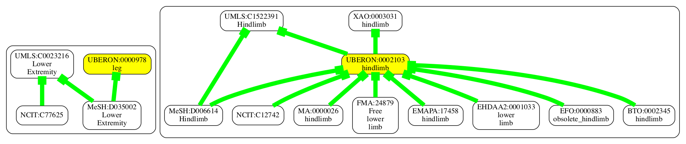
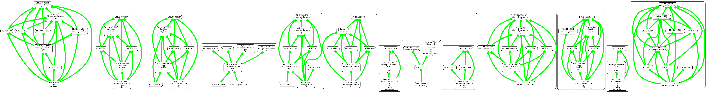

# Mapping Walker

This application will:

 - crawl a mapping endpoint weaving a set of SSSOM mappings
 - input these into boomer
 - visualize the results with obographviz

__THIS IS ALPHA SOFTWARE__

## Requirements

You need the following on your path:

 - [graphviz](https://graphviz.org/)
 - [boomer](https://incatools.github.io/boomer/)
 - [og2dot](https://github.com/cmungall/obographviz)

On MacOS you may need to install openblas via homebrew and set the `OPENBLAS` environment variable before installing dependencies:

```
brew install openblas
export OPENBLAS="$(brew --prefix openblas)"
poetry install
```

## Running

```bash
mapcrawl OMIM:603467
```

you can enter as many CURIEs as you like

The output looks like:


Note the visualization doesn't show the mappings that were rejected - see the full boomer report file. It shows things like:

- [Fanconi anemia](http://purl.obolibrary.org/obo/Orphanet_84) SiblingOf [OMIM_614087](http://purl.obolibrary.org/obo/OMIM_614087)         0.09999999999999998
- [Fanconi anemia](http://purl.obolibrary.org/obo/Orphanet_84) ProperSuperClassOf [OMIM_614087](http://purl.obolibrary.org/obo/OMIM_603467)        (most probable) 0.8
- [aplastic anemia](http://purl.obolibrary.org/obo/MONDO_0015909) EquivalentTo [Anemia, Aplastic](http://purl.obolibrary.org/obo/MeSH_D000741)  (most probable) 0.8
- [Fanconi anemia](http://purl.obolibrary.org/obo/DOID_13636) EquivalentTo [Fanconi Anemia](http://purl.obolibrary.org/obo/MeSH_D005199)        (most probable) 0.8


## Gallery


### Anatomy

* FMA:24879



these are the full results:

- [Lower Extremity](http://purl.obolibrary.org/obo/UMLS_C0023216) EquivalentTo [Lower Extremity](http://purl.obolibrary.org/obo/MeSH_D035002)   (most probable) 0.8
- [hindlimb](http://purl.obolibrary.org/obo/UBERON_0002103) EquivalentTo [Hindlimb](http://purl.obolibrary.org/obo/UMLS_C1522391)       (most probable) 0.8
- [hindlimb](http://purl.obolibrary.org/obo/XAO_0003031) EquivalentTo [hindlimb](http://purl.obolibrary.org/obo/UBERON_0002103) (most probable) 0.8
- [hindlimb](http://purl.obolibrary.org/obo/UBERON_0002103) EquivalentTo [hindlimb](http://purl.obolibrary.org/obo/BTO_0002345) (most probable) 0.8
- [hindlimb](http://purl.obolibrary.org/obo/UBERON_0002103) SiblingOf [](http://purl.obolibrary.org/obo/NCIT_C77625)            0.09999999999999998
- [hindlimb](http://purl.obolibrary.org/obo/UBERON_0002103) EquivalentTo [Hindlimb](http://purl.obolibrary.org/obo/MeSH_D006614)        (most probable) 0.8
- [Lower Extremity](http://purl.obolibrary.org/obo/UMLS_C0023216) SiblingOf [](http://purl.obolibrary.org/obo/NCIT_C12742)              0.09999999999999998
- [hindlimb](http://purl.obolibrary.org/obo/UBERON_0002103) EquivalentTo [](http://purl.obolibrary.org/obo/NCIT_C12742) (most probable) 0.8
- [hindlimb](http://purl.obolibrary.org/obo/UBERON_0002103) SiblingOf [Lower Extremity](http://purl.obolibrary.org/obo/UMLS_C0023216)           0.09999999999999998
- [hindlimb](http://purl.obolibrary.org/obo/UBERON_0002103) EquivalentTo [hindlimb](http://purl.obolibrary.org/obo/XAO_0003031) (most probable) 0.8
- [hindlimb](http://purl.obolibrary.org/obo/UBERON_0002103) EquivalentTo [obsolete_hindlimb](http://purl.obolibrary.org/obo/EFO_0000883)        (most probable) 0.8
- [hindlimb](http://purl.obolibrary.org/obo/UBERON_0002103) EquivalentTo [hindlimb](http://purl.obolibrary.org/obo/EMAPA_17458) (most probable) 0.8
- [hindlimb](http://purl.obolibrary.org/obo/UBERON_0002103) EquivalentTo [Free lower limb](http://purl.obolibrary.org/obo/FMA_24879)    (most probable) 0.8
- [Hindlimb](http://purl.obolibrary.org/obo/UMLS_C1522391) EquivalentTo [Hindlimb](http://purl.obolibrary.org/obo/MeSH_D006614) (most probable) 0.8
- [hindlimb](http://purl.obolibrary.org/obo/UBERON_0002103) EquivalentTo [lower limb](http://purl.obolibrary.org/obo/EHDAA2_0001033)    (most probable) 0.8
- [leg](http://purl.obolibrary.org/obo/UBERON_0000978) EquivalentTo [Lower Extremity](http://purl.obolibrary.org/obo/MeSH_D035002)      (most probable) 0.8
- [Lower Extremity](http://purl.obolibrary.org/obo/UMLS_C0023216) EquivalentTo [](http://purl.obolibrary.org/obo/NCIT_C77625)   (most probable) 0.8
- [hindlimb](http://purl.obolibrary.org/obo/UBERON_0002103) EquivalentTo [hindlimb](http://purl.obolibrary.org/obo/MA_0000026)  (most probable) 0.8

note boomer effectively rejected some links (SiblingOf) that came from some mappings

### Disease

MONDO:0019249 ! mucopolysaccharidosis




## How it works

It currently queries OxO - it will do a breadth first search until either saturated or either max depth or max queries is reached

All configuration is specified in LinkML yaml - docs will be up soon

Currently it applies the standard SSSOM-py mappings for all predicates obtained from OxO (most mappings in OxO are RELATED but there are some narrow/broad)

Default confidence is 0.8 (currently no mappings in OxO have confidence)

We don't yet allow plugin in of rules - e.g. boost confidence if mapping comes from a more trusted source, or is HumanCurated

## TODO

- fix CURIEs
- add bioportal endpoint (currently uses oxo)
- add ubergraph endpoint


