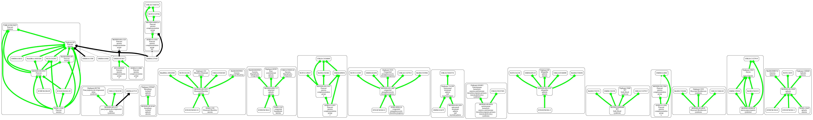

# Mapping Walker

This application will:

 - crawl a mapping endpoint weaving a set of SSSOM mappings
 - input these into boomer
 - visualize the results with obographviz

__THIS IS ALPHA SOFTWARE__

## Requirements

You need the following on your path:

 - boomer
 - og2dot

## Running

```bash
mapcrawl OMIM:603467
```

you can enter as many CURIEs as you like

The output looks like:



## Gallery


### Anatomy

* FMA:24879


## TODO

- add bioportal


